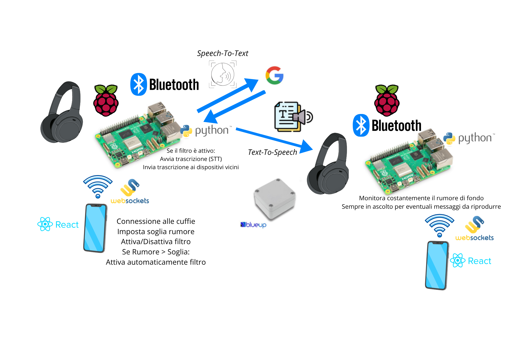

# 🎧 Presentazione del progetto

Il progetto si propone di sviluppare un **sistema intelligente per la protezione uditiva e la comunicazione in ambienti di lavoro rumorosi**, utilizzando un'infrastruttura IoT composta da **Raspberry Pi**, **cuffie Bluetooth** e **beacon BLE**.

L'obiettivo è monitorare il livello di pressione sonora dell’ambiente e attivare un filtro elettronico in caso di superamento di una soglia configurabile. Durante questa fase di insonorizzazione, se l’operatore parla, la voce viene convertita in testo tramite un sistema di **Speech-To-Text** e trasmessa agli altri operatori nelle vicinanze. La comunicazione viene poi riprodotta vocalmente tramite **Text-To-Speech**, garantendo una comunicazione efficace senza compromettere la sicurezza.

Il sistema riduce il carico cognitivo e fisico associato all'uso di chat o comandi vocali diretti, mantenendo la comunicazione fluida e discreta. A differenza delle soluzioni esistenti, questo approccio passivo permette di continuare a interagire con i colleghi senza dover rimuovere le cuffie o interrompere le operazioni.

---

# 🔧 Tecnologie e prototipazione

Il sistema sfrutta dispositivi commerciali già disponibili, come **cuffie Bluetooth a basso costo**, e l'attenuazione del rumore viene attualmente **simulata** per la validazione della logica progettuale. L’architettura software è comunque pensata per essere integrabile in un prodotto reale.

Il progetto si inserisce pienamente nell’ambito **IoT**, grazie all’uso di:
- Dispositivi connessi e wearable
- Sensori acustici e beacon BLE
- Elaborazione dei dati in tempo reale
- Tecnologie di comunicazione vocale automatica

Si ispira inoltre ai principi della **Safety Technology**, migliorando la sicurezza sul lavoro in ambienti industriali critici e rumorosi, e della **Wearable Technology**, favorendo un’interazione continua e naturale con il sistema.

---

# 🏗️ Architettura
L'architettura del sistema è raffigurata nel diagramma seguente:

---

# 📦 Repository GitHub

Il progetto è suddiviso in più componenti, ciascuno con il proprio repository:

- **STT-Broadcast** – Monitoraggio rumore e riconoscimento vocale → [GitHub Repo](https://github.com/UniSalento-IDALab-IoTCourse-2024-2025/wot-project-2024-2025-STT-Broadcast-StabileRomano.git)
- **TTS-Receiver** – Ricezione e sintesi vocale del testo in arrivo → [GitHub Repo](https://github.com/UniSalento-IDALab-IoTCourse-2024-2025/wot-project-2024-2025-TTS-Receiver-StabileRomano.git)
  
Inoltre è possibile accedere alla presentazione del progetto al seguente [link](https://unisalento-idalab-iotcourse-2024-2025.github.io/wot-project-presentation-StabileRomano/)

---

# 📱 Descrizione
Questo repository contiene lo sviluppo dell'app mobile che funge da interfaccia utente per gli operatori, permettendo una gestione flessibile e intuitiva del sistema di protezione uditiva.

L'app consente agli utenti di:

- **Collegarsi/scollegarsi** al Raspberry Pi in modo semplice e rapido

- **Modificare la soglia di rumore** personalizzata in base alle esigenze dell'ambiente di lavoro

- **Attivare/disattivare manualmente** il filtro di insonorizzazione quando necessario

- **Personalizzare il proprio nome** per una comunicazione più efficace con i colleghi

- **Ricevere notifiche push** quando il sistema rileva un superamento della soglia sonora e attiva automaticamente il filtro

Grazie a un'interfaccia **user-friendly**, gli operatori possono monitorare e controllare il sistema in tempo reale, migliorando l'esperienza d'uso e garantendo una risposta immediata alle condizioni ambientali critiche.
